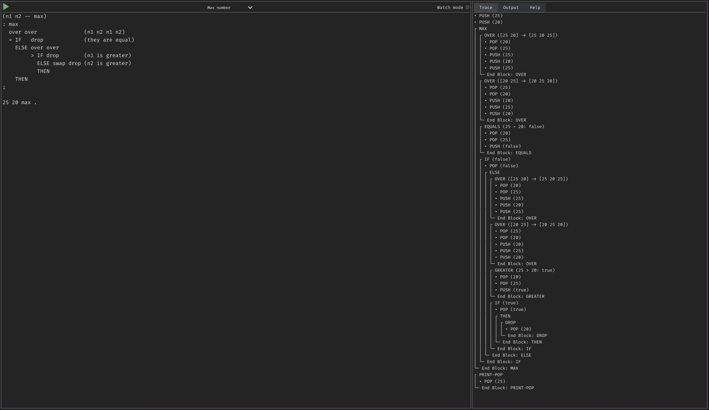

# Language Development Platform

This repository is a playground for language development research.

Currently, it has an implementation of [Forth](https://en.wikipedia.org/wiki/Forth_(programming_language))-like pure [stack-oriented](https://en.wikipedia.org/wiki/Stack-oriented_programming) language which prints the entire path of execution.

Try here: https://lang-dev.pungy.me

Example of following code execution:

```text
(n1 n2 -- max)
: max
  over over               (n1 n2 n1 n2)
  = IF   drop             (they are equal)
    ELSE over over
         > IF drop        (n1 is greater)
           ELSE swap drop (n2 is greater)
           THEN
    THEN
;

20 25 max .
```


